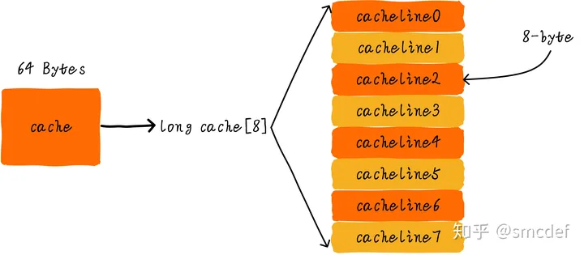
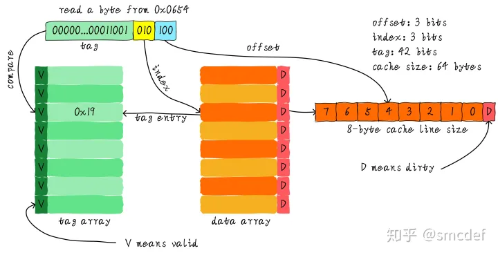
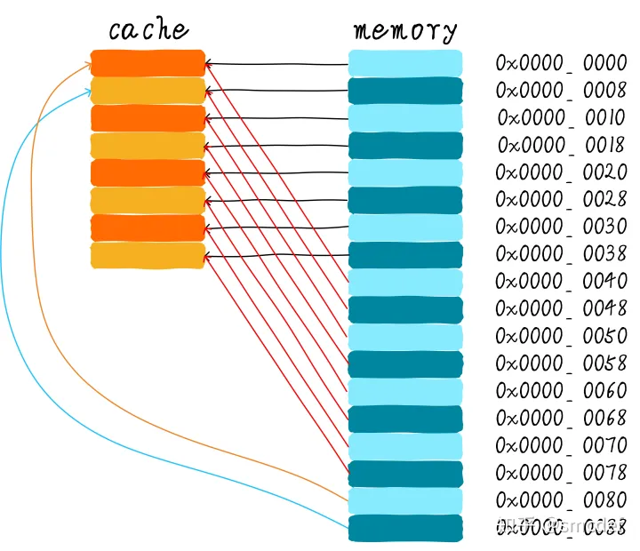
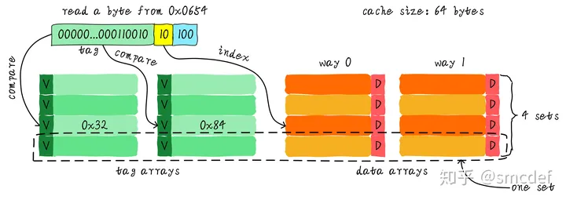
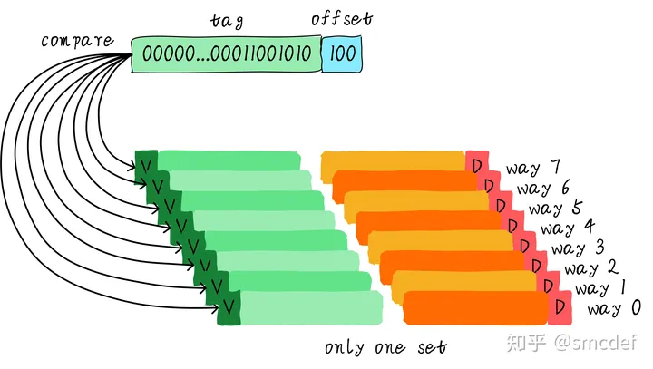
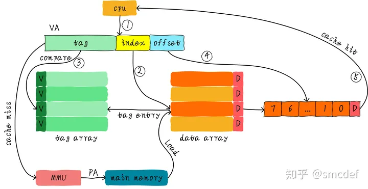
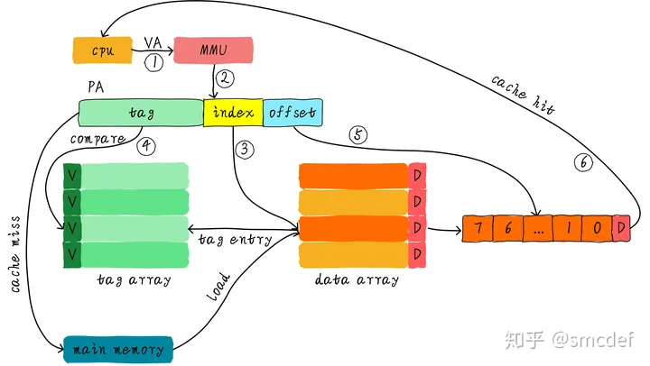
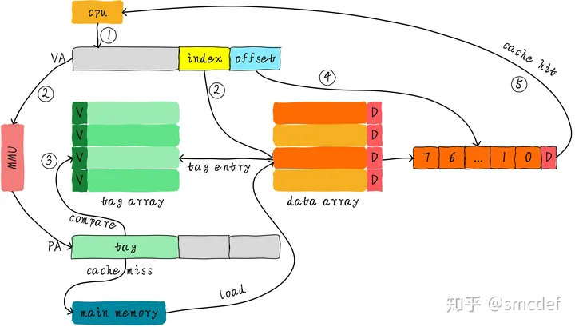

### Cache

#### 基本原理

cache位于CPU和主存之间，作为主存数据的缓存，它的容量比主存小但是访问速度较快。
CPU在需要从主存 load/store 数据时，会在 cache 中查找对应地址的数据是否缓存在 cache 中，如果数据缓存在 cache 中，则直接从 cache 中获取数据。当 cache 中没有缓存需要的数据时，依然需要从主存中 load 数据。
为了进一步提升性能，引入多级 cache，称为 L1 cahce、L2 cache、L3 cache 等。等级越高，容量越大，速度越慢，但是依然比主存要快。
[Cache 基本原理](https://zhuanlan.zhihu.com/p/102293437)

##### Cache 结构

cache 由 cache line 构成。cache line 是 cache 和主存之间传输的最小单位。当从主存 load 数据时，如果 cache 未命中，那么 cache 控制器会从主存中一次性 load cache line 大小的数据到 cache 中。

假如 cache size 为 64bytes，共分为 8 个 cache line，每个 cache line 大小是 8bytes，当 CPU 从 0x0654 地址读取一个字节时，操作如下：

地址低3位（蓝色部分）称为 offset 用来在 cache line 中找到对应字节。8 个 cache line 同样需要3位地址（黄色部分）表示，称为 index。不同的地址取模后会对应到同样的 cache line，所以引入 tag array 区域，tag array 和 data array 一一对应。
依据 index 找到对应 cache line，取出 cache line 对应的 tag，如果 tag 和所需数据地址相同，那么说明 cache 命中。valid bit 表示缓存中的数据是否有效。

- 直接映射缓存 Direct mapped cache

上图表示的 cache 结构为直接映射，直接映射在硬件设计上会更加简单，所以成本也会更低。同时可以看到 0x0000、0x0040、0x0080 地址对应的 cache line 是相同的，当我们顺序访问这些地址时，cache 无法命中，只能从主存中读取数据，这称为 cache 颠簸。

- 多路组相连缓存 Set associative cache

cache line 被分为两路，每一路 4 行 cache line，将 index 一样的 cache line 称为一组，上图中共有 4 组。同样查找 0x0654 地址是，offset 还是 3bits，但是由于 cache line 被分为了两路 4 组，所以 index 只需要 2bits，也被称为组索引。
先根据 index 找到组即 set，然后将组内所有 cache line 对应的 tag 和地址中的 tag 进行对比，其中一个相同就命中。
多路组相连相比直接映射硬件成本会更高，因为每次比较 tag 时需要比较多路的 cache line 对应的 tag，比较会更加耗时（部分硬件可以并行比较，比较速度会加快，硬件成本更高）。但是可以有效减低 cache 颠簸的频率。

- 全相连缓存 Fully associative cache

所有 cache line 都在同一个组中，不再需要 index 部分，最大程度降低 cache 颠簸的频率，但是硬件成本会更高，比较速度也会变慢。

##### Cache 分配策略
- 读分配 read allocation
CPU 读数据时发生数据缺失，这时会分配一个 cache line 从主存读取数据，默认情况 cache 都支持读分配。
- 写分配 write allocation
CPU 写数据时发生数据缺失，会考虑写分配。当不支持写分配时，写指令会直接更新主存数据。支持写分配时，会现将数据读入 cache line，然后更新 cache 中的数据。

##### Cache 更新策略
- 写直通 write through
CPU 执行 store 指令并且 cache 命中时，更新 cache 中的数据同时更新主存中的数据，**cache 和主存中的数据始终保持一致**。
- 写回 write back
CPU 执行 store 指令并且 cache 命中时，只更新 cache 中的数据，同时 dirty 位置位，主存的数据只会在 cache 替换或显示 clean 操作时才更新，**cache 和主存中的数据可能不一致**

#### Cache 组织方式

[Cache 组织方式](https://zhuanlan.zhihu.com/p/107096130)

##### 虚拟高速缓存 VIVT

如上图所示，CPU 需要 load 主存数据时，将虚拟地址送入 cache 控制器，如果 cache 命中，则返回数据给 CPU，否则将虚拟地址通过 MMU 转为物理地址从主存中获取数据。
由于 index 和 tag 都来自于虚拟地址，所以称为虚拟高速缓存 VIVT(Virtually Indexed Virtually Tagged)。VIVT 主要面临两个问题：歧义和别名。

- 歧义
相同的虚拟地址映射不同的物理地址时会导致歧义。可以在切换进程时主动 flush cache。
- 别名
不同的虚拟地址映射相同的物理地址时会导致别名。可以采用：针对共享数据所在的页的映射方式采用 nocache 访问；在切换进程时主动 flush cache。

##### 物理高速缓存 PIPT

为了避免 VIVT 带来的歧义和别名的问题，index 和 tag 直接采用物理地址，这称为物理高速缓存 PIPT(Physically Indexed Physically Tagged)。
CPU 发出的虚拟地址需要进过 MMU 转换为物理地址，再去查找是否 cache 命中，在查找性能上没有 VIVT 简洁高效。为了加速 MMU 地址转换，硬件上也会有一块存放虚拟地址和物理地址映射关系的缓存 TLB。虽然软件层面不需要维护，但是硬件设计上会比 VIVT 更加复杂。

##### 物理标记的虚拟高速缓存 VIPT

为了提升 cache 查找性能，使用虚拟地址中的 index 先查找对应的 cache line，同时将虚拟地址发送到 MMU 转换为物理地址。cache line 查找完成时，MMU 转换也同时完成，这时再用物理地址中 tag 判断是否 cache 命中，这称为 VIPT(Virtually Indexed Physically Tagged)。
VIPT 采用物理地址的 tag 不存在歧义问题，但是依然有别名问题。

#### 多核 Cache 一致性 - MESI协议

- CPU0 读取 0x40 数据，数据被缓存到 CPU0 的 cache 中，此时 CPU1 没有缓存 0x40 数据，所以标记 cache line 的状态为 Exclusive。**Exclusive** 表示只在一个 CPU 的私有 Cache 中，并且 Cache 中的内容和主存一致。
- CPU1 读取 0x40 数据，发送消息给其他 CPU，发现数据被缓存到 CPU0 私有 Cache，数据从 CPU0 Cache 返回给 CPU1。此时 CPU0 和 CPU1 同时缓存 0x40数据，cache line 状态标记为 Shared。**Shared** 表示数据在多个 CPU 的 Cache 中被缓存，并且 Cache 中的内容和主存一致。
- CPU0 修改 0x40 地址数据，发现 0x40 内容所在 cache line 状态是 Shared。CPU0 发出 invalid 消息传递到其他 CPU。CPU1 接收到 invalid 消息。将 0x40 所在的 cache line 置为 Invalid。**Invalid** 状态表示表明当前 cache line 无效。
- CPU0 收到 CPU1 已经 invalid 的消息，修改 0x40 所在的 cache line 中数据。并更新 cache line 状态为 Modified。**Modified** 表明 cache line 对应的数据仅在一个CPU 私有 Cache 中被缓存，并且其在缓存中的内容与主存的内容不一致，代表数据被修改。后续 CPU0 继续修改 0x40 数据，此时发现其对应的 cache line 的状态是 Modified。因此 CPU0 不需要向其他 CPU 发送消息，直接更新数据即可。
- 如果 0x40 所在的 cache line 需要替换，发现 cache line 状态是 Modified，数据应该先写回主存。

